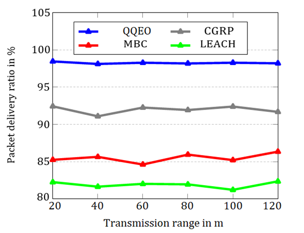
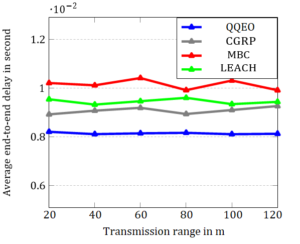
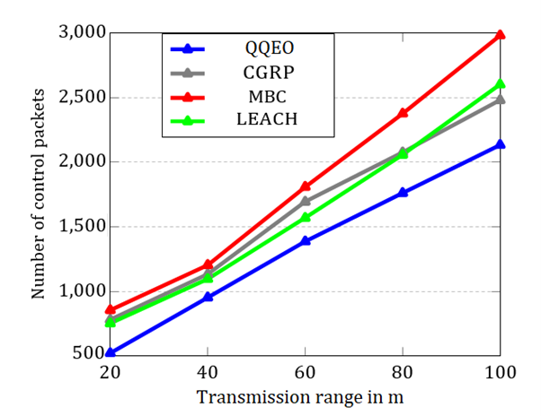
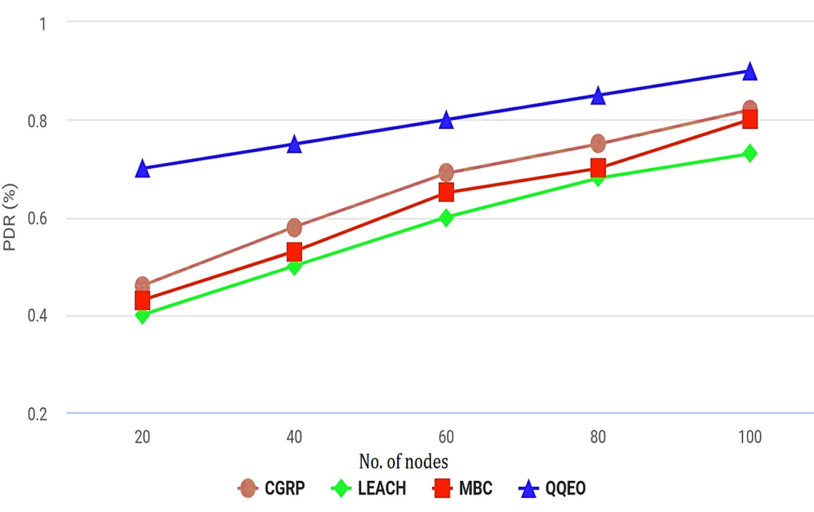
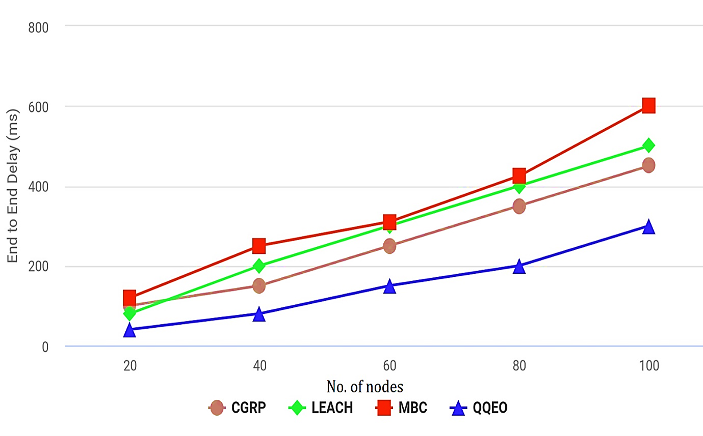
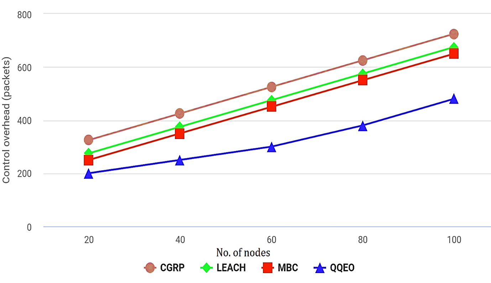
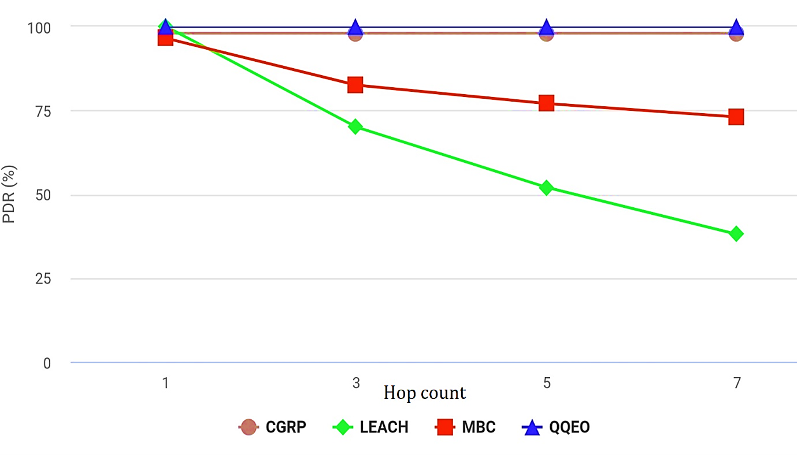
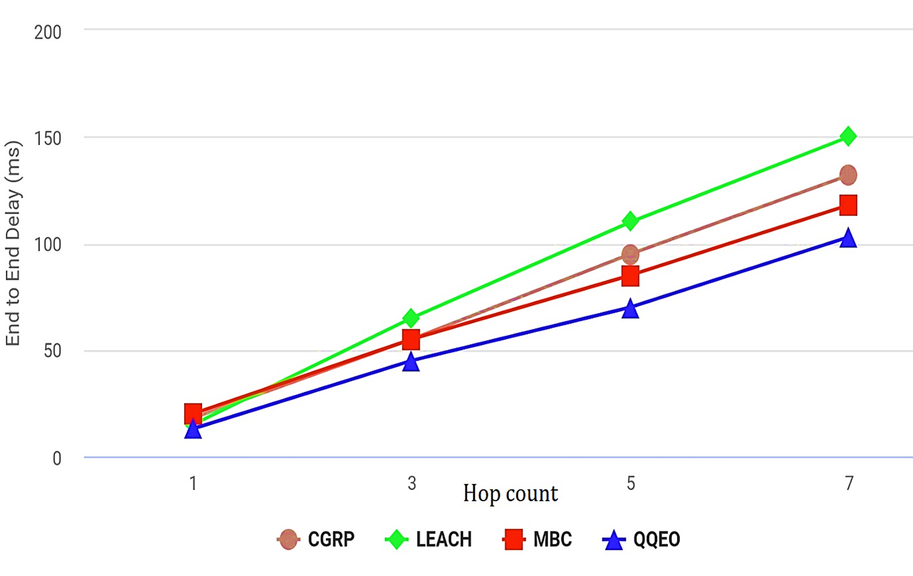

# MANET-simulation
Simulation of Quantum-driven optimization model for energy efficient gateways discovery topology in MANETs

# Description
In todays’ 6G world, the Mobile Ad-hoc Networks (MANETs) plays a vital role as they are self-organising, distributed networks with variable topologies. The Internet of Things (IoT) based MANETs have more sensors and sends data through cloud servers. But, the MANET sensor stream is moderately efficient and packet loss increases owing to numerous phenomena. MANET energy deficiency mainly due to the sensors that transmit messages to the gateway node regularly. This work uses MANET, IoT, and WSN to create a heterogeneous IT network with novel challenges. The tree oriented root less gateway finding approach reduces dissemination when exploring the gateways, thereby a quantum driven Qu-bit Evolutionary optimization (QQEO) pathway is created in this research work. Traditional evolutionary optimization becomes increasingly complex as the number of routes discovered and reiterations needed to improve performance increase due to the sequential algorithm execution. Quantum parallel processing and coherence can speed up the optimization solution of the proposed model with respect to exploration issues. QQEOs can prevent early conjunction with a basic employment of offloading, reactive as well as proactive modules, making them better for large-scale problems than other broad evolutionary algorithms. Benchmarked datasets show that upgrading new GW exploration procedures is feasible. The relative comparison predicts about the efficacy of QQEO proved that the proposed model outperforms the traditional algorithms in time to determine various gateways (28% enhancement), time taken for the previous node to determine all gateways (75% enhancement), overhead on routing (55% improvement), and overhead on gateway (65% improvement).

# Implementation
- Core system language: C++.
- Input configuration script: My own defined format

# How to use
- make sim
  (OR)
- make debug   (For debugging)
- ./sim input_file.config
  The simulation will start according to parameters set in the input file. Out is a trace file
  quite similar to ns2 trace-file format with the name input_file.tr.
- Trace files can be parsed using your own scripts written in any scripting language like awk,
  python, etc.
  
#						ENJOY

Figure 2: Packet Delivery Ratio

Figure 3: Average end-to-end delay

Figure 4: Control overhead vs sensor nodes

Figure 5: PDR vs node count

Figure 6: End to End delay vs node count

Figure 7: Control overhead vs node count

Figure 8: PDR vs hop count

Figure 9: End to End delay vs hop count

